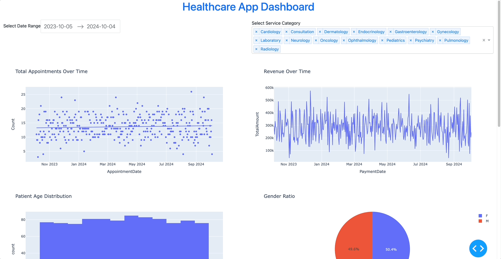

# Healthcare App Dashboard

A comprehensive healthcare dashboard built using Python, SQL, and Dash by Plotly to visualize patient demographics, appointments, and revenue data. The dashboard is designed as a general solution that can be customized for any company working in the private healthcare sector. The synthetic data is generated in Hungarian by default but can be configured for any language supported by the data generation script.

---

## Table of Contents

- [Project Overview](#project-overview)
- [Features](#features)
- [Implementation Steps](#implementation-steps)
- [Prerequisites](#prerequisites)
- [Installation](#installation)
- [Database Setup](#database-setup)
  - [1. Install SQL Server via Docker](#1-install-sql-server-via-docker)
  - [2. Create the Database](#2-create-the-database)
  - [3. Generate Synthetic Data](#3-generate-synthetic-data)
- [Environment Setup](#environment-setup)
- [Running the Application](#running-the-application)
- [Future Extensions](#future-extensions)
- [Project Structure](#project-structure)
- [Dependencies](#dependencies)
  - [Requirements.txt](#requirementstxt)
- [Troubleshooting](#troubleshooting)
- [License](#license)
- [Acknowledgments](#acknowledgments)
- [Contributing](#contributing)

---

## Project Overview

The Healthcare App Dashboard is a versatile tool designed to provide insights into patient demographics, appointment trends, and revenue data for healthcare organizations. The application is built to be highly customizable, allowing it to be adapted to the needs of any healthcare provider.

This project demonstrates the integration of database management, data modeling, and interactive data visualization using SQL Server, Python, and Dash.

---

## Features

- **Customizable Data Generation**:
  - Synthetic data generation in Hungarian, with the ability to generate data in any language based on the generator script setup.
- **Patient Demographics Visualization**:
  - Age distribution histogram.
  - Gender ratio pie chart.
- **Appointment Analysis**:
  - Total appointments over time with trendline.
  - Appointment status distribution.
  - Interactive date range filtering.
- **Revenue Analysis**:
  - Revenue over time.
  - Annual revenue with year-over-year growth.
  - Year-to-date revenue comparison.
- **Interactive Filters**:
  - Date range selector.
  - Service category dropdown menu.

---


## 🎥 Demo

Check out a quick demonstration of the Healthcare App Dashboard in action:



---

## Implementation Steps

The project involves several key steps, each showcasing different aspects of database setup, data modeling, and data visualization:

1. **Database Configuration**:
   - Set up SQL Server using Docker for easy deployment and scalability.
   - Create a normalized database schema with tables for patients, services, appointments, and billing.
   - Utilize the `create_tables.sql` script to establish the database structure.

2. **Data Generation**:
   - Implement a data generation script (`data_generation.py`) using the `Faker` library to populate the database with realistic synthetic data.
   - Configure the script to generate data in Hungarian or any other supported language, demonstrating internationalization capabilities.

3. **Data Retrieval with SQL**:
   - Write SQL queries to retrieve and aggregate data from the database.
   - Optimize queries for performance and scalability.

4. **Python Application Development**:
   - Develop a Python application using Dash and Plotly for interactive data visualization.
   - Use `pyodbc` to connect to the SQL Server database and `pandas` for data manipulation.

5. **Interactive Dashboard Creation**:
   - Create interactive graphs and charts, including trendlines and statistical analyses.
   - Implement user interface elements like date pickers and dropdown menus for dynamic data filtering.

6. **Deployment and Testing**:
   - Test the application to ensure it works across different environments.
   - Document the setup process for ease of replication and deployment.

This structured approach highlights proficiency in database management, data processing, and application development, providing a strong foundation for future enhancements.

---

## Prerequisites

- **Operating System**: macOS, Windows, or Linux
- **Python**: Version 3.7 or higher
- **Docker**: For running SQL Server in a container
- **Git**: For cloning the repository

---

## Installation

### **1. Clone the Repository**

```bash
git clone https://github.com/aczimermate/healthcare-app.git
cd healthcare-app
```

### **2. Set Up a Virtual Environment**

```bash
python3 -m venv venv
source venv/bin/activate  # On Windows: venv\Scripts\activate
```

### **3. Install Required Python Packages**

```bash
pip install -r requirements.txt
```

---

## Database Setup

### **1. Install SQL Server via Docker**

Running SQL Server in a Docker container simplifies the setup and ensures cross-platform compatibility.

**Steps:**

1. **Install Docker**:

   - Download and install Docker Desktop from [Docker's official website](https://www.docker.com/products/docker-desktop).

2. **Pull the SQL Server Docker Image**:

   ```bash
   docker pull mcr.microsoft.com/mssql/server:2019-latest
   ```

3. **Run the SQL Server Container**:

   ```bash
   docker run -e "ACCEPT_EULA=Y" -e "SA_PASSWORD=YourStrong!Passw0rd" \
   -p 1433:1433 --name sql_server \
   -d mcr.microsoft.com/mssql/server:2019-latest
   ```

   - Replace `YourStrong!Passw0rd` with a secure password.

4. **Verify the Container is Running**:

   ```bash
   docker ps
   ```

### **2. Create the Database**

#### **Using `create_tables.sql`**

- The `create_tables.sql` file contains all the SQL commands needed to create the `HealthcareDemo` database and its tables.

**Steps:**

1. **Connect to SQL Server**:

   - Use a SQL client like **Azure Data Studio** (cross-platform) or **SQL Server Management Studio (SSMS)** (Windows only).
   - Connect to `localhost` on port `1433` using the `SA` account and the password set in the Docker run command.

2. **Run `create_tables.sql`**:

   - Open `create_tables.sql` in your SQL client.
   - Execute the script to create the `HealthcareAppDB` database and all necessary tables.

3. **Verify the Database and Tables**:

   - Ensure that the `HealthcareAppDB` database and its tables are created successfully.

### **3. Generate Synthetic Data**

#### **a. Customize Data Generation**

- The data generation script `data_generation.py` can produce synthetic data in Hungarian or any other language supported by the `Faker` library.
- Modify the script to change the `locale` parameter.

```python
from faker import Faker
fake = Faker('hu_HU')  # For Hungarian
# fake = Faker('en_US')  # For English
```

#### **b. Update Database Connection Details**

- Update the connection string in `data_generation.py`:

```python
conn = pyodbc.connect(
    "DRIVER={ODBC Driver 18 for SQL Server};"
    "SERVER=localhost,1433;"
    "DATABASE=HealthcareAppDB;"
    "UID=SA;"
    "PWD=YourStrong!Passw0rd;"
    "Encrypt=yes;"
    "TrustServerCertificate=yes;"
)
```

#### **c. Run the Data Generation Script**

```bash
python data_generation.py
```

- This script will generate synthetic data for:

  - Patients (in the specified language)
  - Services
  - Appointments
  - Billing

---

## Environment Setup

### **1. Create a `.env` File**

Create a `.env` file in the project root directory to store environment variables:

```ini
# .env file
DRIVER=ODBC Driver 18 for SQL Server
SERVER=localhost,1433
DATABASE=HealthcareAppDB
DB_UID=SA
DB_PWD=YourStrong!Passw0rd
```

**Note**: Ensure the credentials match those used in the Docker setup.

### **2. Install Additional Dependencies**

Ensure all required packages are installed:

```bash
pip install -r requirements.txt
```

---

## Running the Application

1. **Activate the Virtual Environment**:

   ```bash
   source venv/bin/activate  # On Windows: venv\Scripts\activate
   ```

2. **Run the Application**:

   ```bash
   python app.py
   ```

3. **Access the Dashboard**:

   Open your web browser and navigate to `http://127.0.0.1:8050/` to view the dashboard.

---

## Future Extensions

This project is designed with scalability and future enhancements in mind. Potential extensions include:

- **Machine Learning (ML) Integrations**:

  - Predictive analytics for patient outcomes.
  - Appointment no-show predictions.
  - Revenue forecasting.

- **Artificial Intelligence (AI) Capabilities**:

  - Natural Language Processing (NLP) for patient feedback analysis.
  - AI-driven recommendations for operational improvements.

- **Advanced Data Analytics**:

  - Integration with big data platforms.
  - Real-time data processing and visualization.

- **Internationalization**:

  - Support for multiple languages in the dashboard interface.
  - Enhanced data generation for diverse locales.

---

## Project Structure

```
healthcare-app/
├── app.py                # Main application script
├── create_tables.sql     # SQL script to create database and tables
├── data_generation.py    # Script to generate synthetic data
├── requirements.txt      # Python package dependencies
├── .env                  # Environment variables file
├── README.md             # Project documentation
└── Dockerfile            # (Optional) Dockerfile for containerizing the app
```

---

## Dependencies

All Python package dependencies are listed in the `requirements.txt` file:

### Requirements.txt

```txt
dash==2.11.0
dash-bootstrap-components==1.4.1
pandas==1.5.3
plotly==5.16.1
pyodbc==5.0.1
python-dotenv==1.0.0
statsmodels==0.14.0
faker==19.2.0
```

To install the dependencies, run:

```bash
pip install -r requirements.txt
```

---

## Troubleshooting

- **ODBC Driver Issues**:

  - Ensure that the Microsoft ODBC Driver 18 for SQL Server is installed.
  - For macOS and Linux users, install `unixODBC` and the ODBC driver via Homebrew or your package manager.

- **Docker Connection Issues**:

  - Ensure the SQL Server Docker container is running.
  - Verify that the port mapping is correct (`-p 1433:1433`).
  - Check firewall settings that may block the connection.

- **Environment Variables Not Loading**:

  - Ensure the `.env` file is in the project root directory.
  - Verify that `python-dotenv` is installed.

- **Module Not Found Errors**:

  - Install missing modules using `pip install <module_name>`.

- **Database Connection Errors**:

  - Verify your database credentials in the `.env` file.
  - Ensure that SQL Server is running and accessible.
  - Use `TrustServerCertificate=yes;` if encountering SSL certificate errors.

- **Trendline Not Displayed**:

  - Ensure that `statsmodels` is installed as it's required for plotting trendlines with Plotly Express.

---

## License

This project is licensed under the MIT License.

---

## Acknowledgments

- **Dash and Plotly** for providing the web framework and visualization tools.
- **Faker** library for generating synthetic data.
- **Microsoft SQL Server** for database management.
- **Docker** for simplifying the deployment process.
- **Community Resources** and documentation that supported this project.

---

## Contributing

Contributions are welcome! If you'd like to contribute to this project, please follow these steps:

1. **Fork the Repository**:

   - Click the "Fork" button at the top right corner of the repository page to create a copy in your GitHub account.

2. **Clone the Forked Repository**:

   ```bash
   git clone https://github.com/aczimermate/healthcare-app.git
   cd healthcare-app
   ```

3. **Create a New Branch**:

   ```bash
   git checkout -b feature/your-feature-name
   ```

4. **Make Your Changes**:

   - Implement your feature or fix.

5. **Commit and Push Your Changes**:

   ```bash
   git add .
   git commit -m "Add your descriptive commit message"
   git push origin feature/your-feature-name
   ```

6. **Submit a Pull Request**:

   - Go to the original repository on GitHub and click "Compare & pull request".
   - Provide a clear description of your changes and submit the pull request.

---

**Note**: This project provides a comprehensive example of integrating database setup, data modeling, SQL querying, Python programming, and data visualization. It's designed to be flexible and extensible, making it suitable for adaptation to various healthcare organizations. The synthetic data generation can be customized for different languages, demonstrating the potential for internationalization.

Feel free to explore, modify, and enhance the application to suit your specific needs or to contribute improvements back to the project.